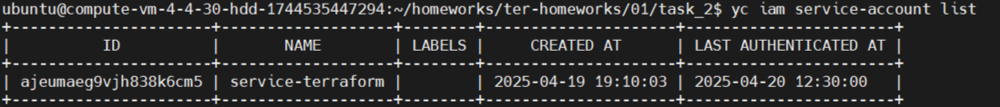
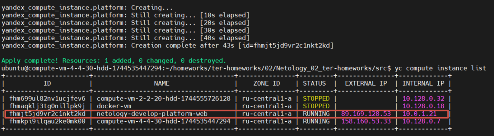
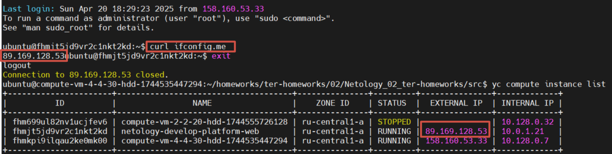
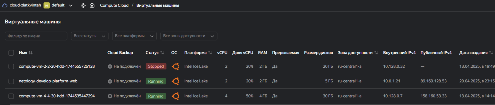
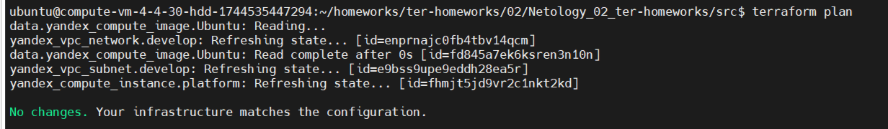
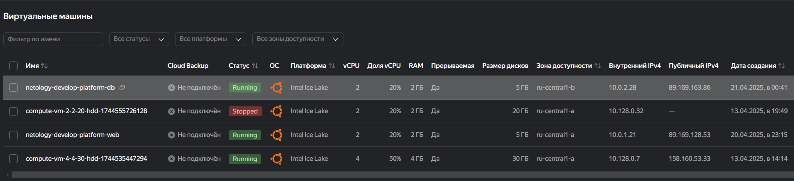
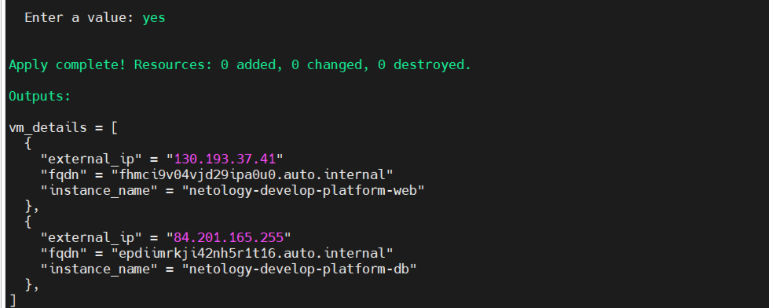
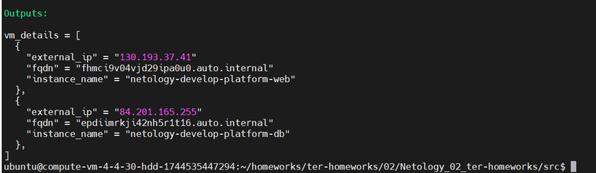

# Домашнее задание по модулю Основы Terraform. Yandex Cloud  

Описание замечаний и исправлений к ДЗ находятся тут:
[Домашнее задание по модулю Основы Terraform. Yandex Cloud](./correction_work.md)


Создал сервисный аккаунт:  
  


## Задача 1  
  
В файл variables.tf внёс свой текущий SSH-ключ.  
<details>  
<summary>Часть кода в variables.tf:</summary>  

```sh  
variable "vms_ssh_root_key" {  
  type        = string  
  default     = "ssh-ed25519 AAAA999999999999999999999999 yandex_cloud"    
  description = "ssh-keygen -t ed25519"  
}  
```  
</details>  

Создал файл `personal.auto.tfvars` и внёс туда переменные: `cloud_id`, `folder_id`, `vpc_name`. 


#### Запускаю проект:  
`terraform apply`  

**Ошибки**:  
1. desc = Platform "standart-v4" not found  
Орфографическая ошибка + не актуальная платформа, список актуальных тут https://yandex.cloud/ru/docs/compute/concepts/vm-platforms  
Исправил на `platform_id = "standard-v3"`  

2. Проверяю минимальные параметры для этой платформы в веб-интерфейсе:  
    Меняю vCPU = 2  
    RAM = 2  
    Гарантированная доля vCPU = 20%  

**Ответ:** в системе можно выбрать только стандартные предустановленные платформы с определёнными конфигурациями ядер, памяти и доступности.

<details>
<summary>Часть кода в main.tf:</summary>

```sh
resource "yandex_compute_instance" "platform" {  
  name        = "netology-develop-platform-web"
  platform_id = "standard-v3"
  resources {
    cores         = 2
    memory        = 2
    core_fraction = 20
  }
}
```
</details>




### Ответы на вопросы:  
- preemptible = true создание ВМ с прерыванием. Она работает 24 часов и может быть остановлена Compute Cloud в любой момент. Может пригодиться если забыли удалить ресурсы на Yandex Cloud. Чтобы деньги не тратились.   
- core_fraction указывает базовую производительность ядра в процентах. Гарантированная доля vCPU, которая будет выделена ВМ. ВМ с гарантированной долей меньше 100% обеспечивают указанный уровень производительности с вероятностью временного повышения вплоть до 100%. Эти ВМ подходят для задач, которые не требуют постоянной гарантии производительности vCPU на 100%.  

### Скриншот успешного подключения к консоли ВМ через ssh.  


### Скриншот ЛК Yandex Cloud с созданной ВМ.  


## Задача 2  

1. Изучите файлы проекта.  
2. Замените все "хардкод" значения для ресурсов **yandex_compute_image** и **yandex_compute_instance** на **отдельные** переменные. К названиям переменных ВМ добавьте в начало префикс **vm_web_** .  Пример: **vm_web_name**.  
2. Объявите нужные переменные в файле variables.tf, обязательно указывайте тип переменной. Заполните их **default** прежними значениями из main.tf.  
3. Проверьте terraform plan (изменений быть не должно).  

## Ответ:  
Я выполнил задание 2: заменил хардкод-значения в `yandex_compute_image` и `yandex_compute_instance` на переменные с префиксом `vm_web_`, объявил их в `variables.tf` и проверил `terraform plan`.  

---

### Выполнение задания  

#### 1. Определил хардкод-значения  
- В `main.tf`:
  - `yandex_compute_image.Ubuntu`: `family = "ubuntu-2004-lts"`.
  - `yandex_compute_instance.platform`:
    - `name = "netology-develop-platform-web"`
    - `platform_id = "standard-v3"`
    - `cores = 2`
    - `memory = 2`
    - `core_fraction = 20`
    - `preemptible = true`

#### 2. Объявил переменные в `variables.tf`
- Добавил переменные с префиксом `vm_web_` и типами:
  - `vm_web_image_family` (string)
  - `vm_web_name` (string)
  - `vm_web_platform_id` (string)
  - `vm_web_cores` (number)
  - `vm_web_memory` (number)
  - `vm_web_core_fraction` (number)
  - `vm_web_preemptible` (bool)

#### Исправленный `variables.tf`
<details>
  <summary>Код из variables.tf:</summary>  

```bash  

###cloud vars  

variable "cloud_id" {  
  type        = string  
  description = "https://cloud.yandex.ru/docs/resource-manager/operations/cloud/get-id"  
}  

variable "folder_id" {  
  type        = string  
  description = "https://cloud.yandex.ru/docs/resource-manager/operations/folder/get-id"  
}  

variable "default_zone" {  
  type        = string  
  default     = "ru-central1-a"  
  description = "https://cloud.yandex.ru/docs/overview/concepts/geo-scope"  
}  
variable "default_cidr" {  
  type        = list(string)  
  default     = ["10.0.1.0/24"]  
  description = "https://cloud.yandex.ru/docs/vpc/operations/subnet-create"  
}  

variable "vpc_name" {  
  type        = string  
  default     = "develop"  
  description = "VPC network & subnet name"  
}  

###ssh vars  

variable "vms_ssh_root_key" {  
  type        = string
  default     = "ssh-ed25519 AAAA999999999999999999999999 yandex_cloud"   
  description = "ssh-keygen -t ed25519"  
}  


###vm vars
variable "vm_web_image_family" {  
  type        = string  
  default     = "ubuntu-2004-lts"  
  description = "Image family for the VM"  
}  

variable "vm_web_name" {  
  type        = string  
  default     = "netology-develop-platform-web"  
  description = "Name of the VM"  
}

variable "vm_web_platform_id" {  
  type        = string  
  default     = "standard-v3"  
  description = "Platform ID for the VM"  
}  

variable "vm_web_cores" {  
  type        = number  
  default     = 2  
  description = "Number of CPU cores for the VM"  
}  

variable "vm_web_memory" {  
  type        = number  
  default     = 2  
  description = "Amount of memory (GB) for the VM"  
}  

variable "vm_web_core_fraction" {  
  type        = number  
  default     = 20  
  description = "Core fraction for the VM"  
}  

variable "vm_web_preemptible" {  
  type        = bool  
  default     = true  
  description = "Whether the VM is preemptible"  
}  
``` 
</details>  

#### Исправленный `main.tf` - Заменил хардкод-значения на переменные.  

<details>  
<summary>Код из main.tf:</summary> 

```bash
resource "yandex_vpc_network" "develop" {
  name = var.vpc_name
}

resource "yandex_vpc_subnet" "develop" {
  name           = var.vpc_name
  zone           = var.default_zone
  network_id     = yandex_vpc_network.develop.id
  v4_cidr_blocks = var.default_cidr
}

data "yandex_compute_image" "Ubuntu" {
  family = var.vm_web_image_family
}

resource "yandex_compute_instance" "platform" {
  name        = var.vm_web_name
  platform_id = var.vm_web_platform_id
  resources {
    cores         = var.vm_web_cores
    memory        = var.vm_web_memory
    core_fraction = var.vm_web_core_fraction
  }
  boot_disk {
    initialize_params {
      image_id = data.yandex_compute_image.Ubuntu.image_id
    }
  }
  scheduling_policy {
    preemptible = var.vm_web_preemptible
  }
  network_interface {
    subnet_id = yandex_vpc_subnet.develop.id
    nat       = true
  }

  metadata = {
    serial-port-enable = 1
    ssh-keys           = "ubuntu:${var.vms_ssh_root_key}"
  }

}
```
</details>


#### 4. Проверил `terraform plan`
- Запустил:
  ```bash
  terraform plan
  ```
- Получил: "No changes. Your infrastructure matches the configuration."

---

#### Итог
Все хардкод-значения заменены на переменные с префиксом `vm_web_`. `terraform plan` подтвердил, что изменений нет.



## Задача 3  
1. Создайте в корне проекта файл 'vms_platform.tf' . Перенесите в него все переменные первой ВМ.
2. Скопируйте блок ресурса и создайте с его помощью вторую ВМ(в файле main.tf): **"netology-develop-platform-db"** ,  cores  = 2, memory = 2, core_fraction = 20. Объявите ее переменные с префиксом **vm_db_** в том же файле('vms_platform.tf').
3. Примените изменения.

## Ответ:
- Две ВМ (netology-develop-platform-web и netology-develop-platform-db) настроены в main.tf.
- Переменные для обеих ВМ с разными префиксами (vm_web_* и vm_db_*) находятся в vms_platform.tf.
- Новый файл с переменными не нужно дополнительно прописывать — Terraform автоматически его использует.

<details>
<summary>Код из vms_platform.tf:</summary>

```sh
###vm vars (web)
variable "vm_web_image_family" {
  type        = string
  default     = "ubuntu-2004-lts"
  description = "release_family_of_image"
}

variable "vm_web_name" {
  type        = string
  default     = "netology-develop-platform-web"
  description = "name_of_instance"
}

variable "vm_web_platform_id" {
  type        = string
  default     = "standard-v3"
  description = "Platform ID for the VM"
}

variable "vm_web_cores" {
  type        = number
  default     = 2
  description = "count_of_cores_vm"
}

variable "vm_web_memory" {
  type        = number
  default     = 2
  description = "Amount of memory (GB) for the VM"
}

variable "vm_web_core_fraction" {
  type        = number
  default     = 20
  description = "Core fraction for the VM"
}

variable "vm_web_preemptible" {
  type        = bool
  default     = true
  description = "Whether the VM is preemptible"
}

###vm vars (db)
variable "vm_db_image_family" {
  type        = string
  default     = "ubuntu-2004-lts"
  description = "release_family_of_image"
}

variable "vm_db_name" {
  type        = string
  default     = "netology-develop-platform-db"
  description = "name_of_instance"
}

variable "vm_db_platform_id" {
  type        = string
  default     = "standard-v3"
  description = "Platform ID for the DB VM"
}

variable "vm_db_cores" {
  type        = number
  default     = 2
  description = "Number of CPU cores for the DB VM"
}

variable "vm_db_memory" {
  type        = number
  default     = 2
  description = "Amount of memory (GB) for the DB VM"
}

variable "vm_db_core_fraction" {
  type        = number
  default     = 20
  description = "Core fraction for the DB VM"
}

variable "vm_db_preemptible" {
  type        = bool
  default     = true
  description = "Whether the DB VM is preemptible"
}

variable "vm_db_zone" {
  type        = string
  default     = "ru-central1-b"
  description = "Zone for the DB VM"
}

```   
</details>



## Задача 4
1. Объявите в файле outputs.tf output типа map, содержащий { instance_name = external_ip } для каждой из ВМ.  
2. Примените изменения.  

В качестве решения приложите вывод значений ip-адресов команды `terraform output`  

Ответ: Output в Terraform используется для вывода полезной информации о созданных ресурсах после применения конфигурации (terraform apply). Это удобно для автоматизации, мониторинга или передачи данных в другие системы.  

Вывожу: instance_name, external_ip, fqdn.  

    - instance_name: Имя ВМ.  
    - external_ip: Внешний IP-адрес.  
    - fqdn: Полное доменное имя.  
Без хардкода: Использую переменные и ссылки на ресурсы (yandex_compute_instance.platform), чтобы данные динамически подтягивались из конфигурации.  
<details>  
<summary>Код из outputs.tf:</summary>  

```bash  
output "vm_details" {  
  value = [  
    {
      instance_name = yandex_compute_instance.platform.name
      external_ip   = yandex_compute_instance.platform.network_interface.0.nat_ip_address
      fqdn          = yandex_compute_instance.platform.fqdn
    },
    {
      instance_name = yandex_compute_instance.platform_db.name
      external_ip   = yandex_compute_instance.platform_db.network_interface.0.nat_ip_address
      fqdn          = yandex_compute_instance.platform_db.fqdn
    }
  ]
}
```  
</details>  



## Задача 5  
В файле locals.tf опишите в одном local-блоке имя каждой ВМ, используйте интерполяцию ${..} с НЕСКОЛЬКИМИ переменными по примеру из лекции.  
Замените переменные внутри ресурса ВМ на созданные вами local-переменные.  
Примените изменения.  

Ответ:  
В locals.tf создал локальные переменные с интерполяцией `(${var.vm_web_name}` и `${var.vm_db_name}`.  
Заменил имена ВМ в main.tf на local.vm_web_full_name и local.vm_db_full_name.  
Изменения применены, ВМ формируют имена из переменных файла `locals.tf`.  

## Задача 6  
1. Вместо использования трёх переменных ".._cores",".._memory",".._core_fraction" в блоке resources {...}, объедините их в единую map-переменную vms_resources и внутри неё конфиги обеих ВМ в виде вложенного map(object).  
Ответ:  
Создаю вложенный объект, добавлю строгую типизацию для проверки входящих типов и не буду создавать переменные из примера `hdd_size=10` и `hdd_type`, таких переменных у меня нет, и их добавление приведёт к ошибке.  
<details>  
<summary>Код из vms_platform.tf:</summary>  

```bash  
variable "vms_resources" {
  type = map(object({
    cores         = number
    memory        = number
    core_fraction = number
  }))
  default = {
    web = {
      cores         = 2
      memory        = 2
      core_fraction = 20
    }
    db = {
      cores         = 2
      memory        = 2
      core_fraction = 20
    }
  }
  description = "Resources for VMs (web and db)"
}
``` 

2. Создайте и используйте отдельную map(object) переменную для блока metadata, она должна быть общая для всех ваших ВМ.

<details>  
<summary>Код из variables.tf:</summary>  

```bash  
###ssh vars

#variable "vms_ssh_root_key" {
#  type        = string
#  default     = "ssh-ed25519 AAAA999999999999999999999999 yandex_cloud"  
#  description = "ssh-keygen -t ed25519"
#}

###metadata for VMs
variable "metadata" {
  type = map(string)
  default = {
    serial-port-enable = "1"
    ssh-keys           = "ubuntu:ssh-ed25519 AAAA999999999999999999999999 yandex_cloud"
  }
  description = "Metadata for VMs"
}
```  

  
