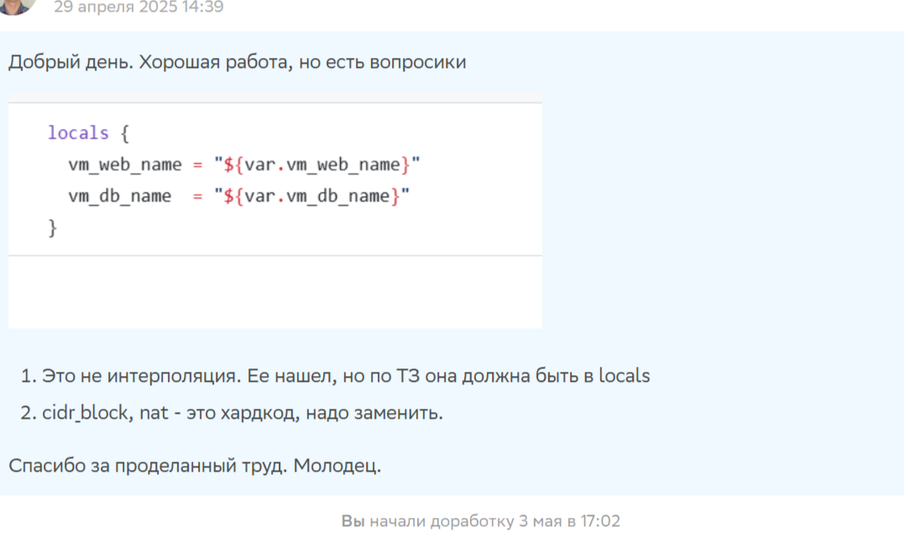
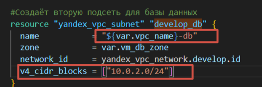
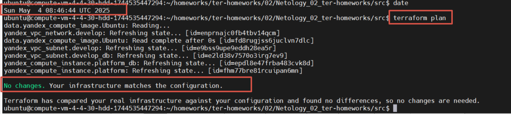
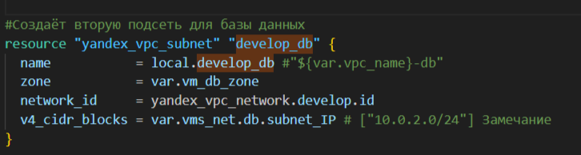
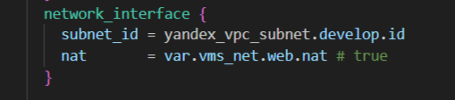

Весь проект накходиться тут:
[Домашнее задание по модулю Основы Terraform. Yandex Cloud](https://github.com/koshnv/Netology_02_ter-homeworks)

Замечане к выполенной работе:


## Исправление:

1) "Это не интерполяция. Ее нашел, но по ТЗ она должна быть в locals"  
Было в коде:  
  

Разобрался, что такое "интерполяция" в Terraform — это способ вставлять значения переменных или выражений в строки для их динамического формирования. Используется синтаксис ${...}, например, ${var.vpc_name}-${var.environment} берёт значения переменных vpc_name и environment и подставляет их в имя ресурса, как в name = local.develop_db. Это позволяет избежать хардкода и генерировать значения на основе входных данных.

Пример интерполяции `develop_db  = ${var.vpc_name}-${var.environment}`

Я добавил интерполяцию и реализовал динамическую сборку метаданных:
```sh
  develop_db  = "${var.vpc_name}-db" # Формирует имя подсети (например, "develop-db")
  full_metadata  = merge(var.metadata, { ssh-keys = var.ssh-keys_pub }) #Для динамической сборки metadata
```  

`develop_db`: Использует интерполяцию для формирования имени подсети. По умолчанию var.vpc_name = "develop" и var.environment = "db", что даёт "develop-db", совпадающее с текущей конфигурацией, чтобы избежать изменений в terraform plan.  
`full_metadata`: Не является прямой интерполяцией, а использует функцию merge для объединения var.metadata с динамическим значением var.ssh-keys_pub, вынесенным в personal.auto.tfvars.  


В variables.tf я обновил блок metadata, убрав фиксированное значение ssh-keys и заменив его на null, чтобы передать его извне:  
```sh
###metadata for VMs
variable "metadata" {
  type = map(string)
  default = {
    serial-port-enable = "1"
    ssh-keys           = null
  }
  description = "Metadata for VMs"
}
```
Также добавил переменную `ssh-keys_pub` для хранения ключа:  
```sh
variable "ssh-keys_pub" {
  type        = string
  default     = null
  description = "Public SSH key for VM access"
}
```
Добавил переменную `environment` для поддержки интерполяции:  
```sh
variable "environment" {
  type        = string
  default     = "db"
  description = "Environment suffix for subnet naming"
}
```


2. `cidr_block`, `nat` - это хардкод, надо заменить.

Вынес значение переменных в объект `vms_net` который созла в файле `vms_platform.tf`:
```sh
###NET-resources for VMs
variable "vms_net" {
  type = map(object({
    subnet_IP  = list(string)
    nat        = bool
  }))
  default = {
    web = {
      subnet_IP  = ["10.0.1.0/24"]
      nat        = true
    }
    db = {
      subnet_IP  = ["10.0.2.0/24"]
      nat        = true
    }
  }
  description = "NET for VMs (web and db)"
}
```

Стало:

